# ChunkMaster

**High-performance chunk scheduling, ticking, and worldstream optimization for modern Minecraft (NeoForge 1.21.x)**

> ⚙️ ChunkMaster is a mod that reimagines chunk ticking with parallelism, smarter scheduling, and bleeding-edge Java 21 tech like virtual threads to maximize performance and scalability.

---


---

## 🚀 Vision

* Replace vanilla tick queues with an **O(1) per-world Time-Wheel scheduler**
* Parallelize chunk tick processing via **Java 21 virtual threads**
* Introduce **Level-of-Detail (LOD)** tick tiers: HOT, WARM, COLD
* Provide a reactive **ECS-style architecture** for fine-grained systems
* Lay groundwork for **distributed compute** between server & clients

---

## 🧠 Features (Implemented & Roadmap)

### ✅ Currently Implemented

* **Per-world queues** for chunk positions, eliminating cross-dimension scans
* **Async batching** with Java 21 virtual threads (`Executors.newThreadPerTaskExecutor`)
* **Early-exit optimization** when no chunks are queued
* **LODFilter**: sealed `Tier` types and `LODFilter.classify(...)` for HOT/WARM/COLD
* `TickChunkProxy` with explicit `fullTick`, `partialTick`, and `skipTick`
* **Exception isolation** in async tasks
* **Per-chunk metrics logging** for debug and profiling
* **`CommonConfig`** in `config` package via NeoForge’s `ModConfigSpec`
* **`/chunkstatus` command** for real-time tier and queue inspection

### 🔜 In-Progress

* **Time-Wheel Scheduler**: slot-based O(1) scheduling engine
* **ECS + Reactive Pipelines** for modular chunk, block, and entity systems
* **Distributed compute**: cluster scheduling across server & clients
* **Off-heap buffers & vectorized operations** (Project Panama)
* **Integration API** for other mods to hook into the scheduler

### 📅 Long-Term Goals

* GPU-accelerated mesh offloading (Vulkan + JNI)
* Compatibility layer for common performance mods (Lithium, Phosphor)
* Tiered simulation budgets by dimension/biome

---

## 🏗️ Architecture Diagram

```mermaid
flowchart TD
  A[World Tick Start] --> B[ChunkMasterScheduler]
  B --> C{Drain per-world queues}
  C --> D[Early-exit if empty]
  C --> E[Build batchMap: ServerLevel → chunkPos set]
  E --> F[Spawn virtual-thread tasks per chunk]
  F --> G{Classify & dispatch}
  G --> H[Hot → fullTick]
  G --> I[Warm → partialTick]
  G --> J[Cold → skipTick]
  H & I & J --> K[Metrics & Logging]
```



---

## 💻 Development Setup

### Prerequisites

* Minecraft 1.21.x with Parchment mappings
* NeoForge 1.21.x
* Java 21 (Loom & incubator modules enabled)
* IntelliJ IDEA or equivalent IDE
* Gradle 8.6+

### Dependencies

```groovy
dependencies {
   implementation "it.unimi.dsi:fastutil:8.5.6"
   implementation "net.neoforged:neoforge-common:<version>"
}

```

### Running in Development

```bash
./gradlew runClient   # Launch Minecraft client
./gradlew runServer   # Launch dedicated server
```

1. Edit `config/chunkmaster-common.toml` to adjust `hotRadius`/`warmRadius`.
2. Use `/chunkstatus <x> <z>` in-game to check chunk tiers and queue lengths.

---

## 🧪 Testing Checklist

* [ ] No work when no chunks are queued
* [ ] Tasks run on virtual threads without blocking
* [ ] LOD tiers match distance & config
* [ ] Async exceptions are isolated and logged
* [ ] Config reload applies new radii without restart
* [ ] `/chunkstatus` reports accurately

---

## 📜 License

MIT License

> “Tick smarter, not harder.” — The ChunkMaster Manifesto™
