# README.md

**ChunkMaster**

High-performance chunk scheduling, ticking, and worldstream optimization for modern Minecraft (NeoForge 1.21.x)

> ⚙️ ChunkMaster is a mod that reimagines chunk ticking with parallelism, smarter scheduling, and bleeding-edge Java 21 tech like virtual threads to maximize performance and scalability.

---


---

## 🚀 Vision

* Replace vanilla tick queues with an **O(1) per-world Time-Wheel scheduler**
* Parallelize chunk tick processing via **Java 21 virtual threads**
* Introduce **Level-of-Detail (LOD)** tick tiers: HOT, WARM, COLD
* Provide a reactive **ECS-style architecture** for fine-grained systems
* Lay groundwork for **distributed compute** between server & clients

---

## 🧠 Features (Implemented & Roadmap)

### ✅ Currently Implemented

* **Per-world queues** for chunk positions, eliminating cross-dimension scans
* **Async batching** with Java 21 virtual threads (`Executors.newThreadPerTaskExecutor`)
* **Early-exit optimization** when no chunks are queued
* **LODFilter**: sealed `Tier` types and `LODFilter.classify(...)` for HOT/WARM/COLD
* `TickChunkProxy` with explicit `fullTick`, `partialTick`, and `skipTick`
* **Exception isolation** in async tasks
* **Per-chunk metrics logging** for debug and profiling
* **`CommonConfig`** in `config` package via NeoForge’s `ModConfigSpec`
* **`/chunkstatus` command** for real-time tier and queue inspection

### 🔜 In-Progress

* **Time-Wheel Scheduler**: slot-based O(1) scheduling engine
* **ECS + Reactive Pipelines** for modular chunk, block, and entity systems
* **Distributed compute**: cluster scheduling across server & clients
* **Off-heap buffers & vectorized operations** (Project Panama)
* **Integration API** for other mods to hook into the scheduler

### 📅 Long-Term Goals

* GPU-accelerated mesh offloading (Vulkan + JNI)
* Compatibility layer for common performance mods (Lithium, Phosphor)
* Tiered simulation budgets by dimension/biome

---

## 🔮 Bleeding-Edge IO 2.0 Roadmap

Take modded I/O from vanilla HDD stutters to blazing-fast, parallel pipelines that saturate SSDs, leverage SIMD, and offload the JVM heap.

### 1️⃣ Native Region Reader

* **JNI Bridge**: Expose `readRegion(filePath, chunkX, chunkZ)` returning a direct `ByteBuffer`.
* **Asynchronous Disk I/O**: Linux `io_uring` / Windows IOCP for non-blocking readv, overlapping seeks and reads.
* **SIMD-Decompression**: AVX2/AVX-512 accelerated LZ4/Zstd to decompress tens of chunks in parallel per core.
* **Zero-Copy Hand-Off**: Feed raw data from OS page cache directly into Java without extra JVM copies.

### 2️⃣ Off-Thread NBT Parsing & Tile-Entity Init

* **Batch Parsers**: Collect chunk buffers and parse NBT in native threads (Rust/C via JNI) or Loom virtual threads.
* **Lightweight POJOs**: Build minimal data-only objects off-thread, deferring heavy object instantiation.
* **Micro-Batch Apply**: Schedule small `chunk-ready` events on the main thread, applying only 50 chunks per tick for zero hitches.

### 3️⃣ Async Write-Behind & Crash-Safe Journaling

* **In-Memory Change Logs**: Append dirty-chunk events to a circular native memory log instantly.
* **Background Flush Threads**: Coalesce and issue large `O_DIRECT` writev calls in the background.
* **Atomic Journaling**: Write to `.journal` before swapping, giving instant saves and guaranteed crash safety.

### 4️⃣ RAM-Backed Caches & Predictive Prefetch

* **Hybrid DRAM/SSD Arena**: Keep the hottest 512 MiB of chunks in native memory for sub-millisecond access.
* **Predictive LRU Pre-Fetch**: Automatically queue the next ring of chunks around players via async I/O.
* **NUMA-Aware Thread Affinity**: Pin I/O vs parsing threads to separate CPU sockets for max throughput.

### 5️⃣ Real-Time Compression Offload

* **Chunk-Pack Files**: Compress cold chunks with Zstd in the background; decompress on-demand with SIMD.
* **Memory vs Disk Trade**: Dynamically migrate less-used chunks to compressed files, slashing RAM & GC pressure.

> 💡 *Imagine modpacks with hundreds of machines, millions of blocks, and terabytes of world data flying by like a sports car—even on a spinning HDD.*

---

## 🏗️ Architecture Diagram

```mermaid
flowchart TD
  A[World Tick Start] --> B[ChunkMasterScheduler]
  B --> C{Drain per-world queues}
  C --> D[Early-exit if empty]
  C --> E[Build batchMap: ServerLevel → chunkPos set]
  E --> F[Spawn virtual-thread tasks per chunk]
  F --> G{Classify & dispatch}
  G --> H[Hot → fullTick]
  G --> I[Warm → partialTick]
  G --> J[Cold → skipTick]
  H & I & J --> K[Metrics & Logging]
```



---

## 💻 Development Setup

### Prerequisites

* Minecraft 1.21.x with Parchment mappings
* NeoForge 1.21.x
* Java 21 (Loom & incubator modules enabled)
* IntelliJ IDEA or equivalent IDE
* Gradle 8.6+

### Dependencies

```groovy
dependencies {
    implementation "it.unimi.dsi:fastutil:8.5.6"
    implementation "net.neoforged:neoforge-common:<version>"
}
```

### Running in Development

```bash
./gradlew runClient   # Launch Minecraft client
./gradlew runServer   # Launch dedicated server
```

1. Edit `config/chunkmaster-common.toml` to adjust `hotRadius`/`warmRadius`.
2. Use `/chunkstatus <x> <z>` in-game to check chunk tiers and queue lengths.

---

## 🧪 Testing Checklist

* [ ] No work when no chunks are queued
* [ ] Tasks run on virtual threads without blocking
* [ ] LOD tiers match distance & config
* [ ] Async exceptions are isolated and logged
* [ ] Config reload applies new radii without restart
* [ ] `/chunkstatus` reports accurately

---

## 📜 License

MIT License

> “Tick smarter, not harder.” — The ChunkMaster Manifesto™